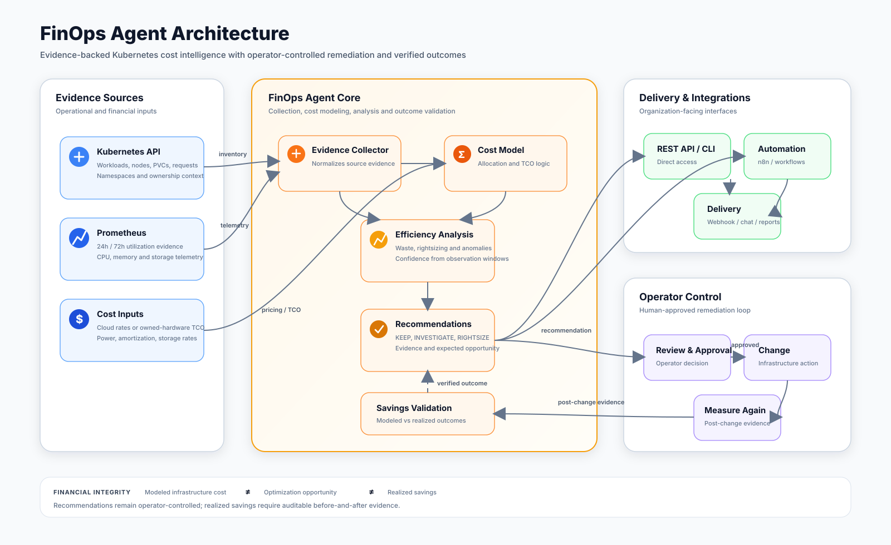

# FinOps Agent

FinOps Agent is a production-tested Kubernetes cost intelligence and optimization agent for engineering, platform, SRE, and finance teams.

It has been exercised over months in commercial operations and is now available for organizations that want evidence-backed cost analysis without turning every optimization signal into an automatic infrastructure change.

## Architecture



The architecture follows a closed evidence loop: operational and cost signals are collected, modeled, analyzed, converted into evidence-backed recommendations, reviewed by operators, and measured again after approved changes so modeled opportunity remains distinct from verified savings.

## What it does

- Analyzes Kubernetes workload and resource evidence.
- Uses observed utilization data to identify over-provisioning and efficiency opportunities.
- Supports infrastructure cost models for cloud or owned hardware.
- Separates modeled infrastructure cost, optimization opportunity, and realized savings.
- Produces explainable recommendations with evidence and confidence levels.
- Keeps remediation approval with the operator by default.
- Supports scheduled operation, webhooks, workflow automation, and CI-style policy checks.

## Operating loop

1. collect resource and utilization evidence;
2. allocate infrastructure cost;
3. detect inefficient resource patterns;
4. produce explainable recommendations;
5. let operators decide what changes to make;
6. measure again after a change;
7. distinguish modeled opportunity from verified savings.

## Quick start

```bash
python -m venv .venv
source .venv/bin/activate
pip install -e .
finops-agent analyze examples/sample-input.json
```

Run the API:

```bash
pip install -e '.[api]'
uvicorn finops_agent.api:app --host 0.0.0.0 --port 8080
```

```bash
curl http://localhost:8080/healthz
curl -X POST http://localhost:8080/v1/analyze -H 'Content-Type: application/json' --data @examples/sample-input.json
```

## Kubernetes deployment

The manifests under `deploy/kubernetes/` provide a secure baseline with non-root execution, a read-only root filesystem, dropped Linux capabilities, resource limits, health probes, and dedicated read-only RBAC.

Review RBAC, telemetry access, pricing inputs, and network policy for your environment before production deployment.

## Build and publish your own image

FinOps Agent ships no prebuilt image. Build it yourself and push it to your own registry:

```bash
docker build -t ghcr.io/<your-org>/finops-agent:1.0.0 .
docker push ghcr.io/<your-org>/finops-agent:1.0.0
```

Then point the Kubernetes deployment at your image. Either edit the `ghcr.io/your-organization/finops-agent:1.0.0` placeholder in `deploy/kubernetes/deployment.yaml`, or update a live deployment directly:

```bash
kubectl set image deployment/finops-agent \
  -n finops-system finops-agent=ghcr.io/<your-org>/finops-agent:1.0.0
```

Prefer running locally instead? `pip install -e '.[api]'` followed by `uvicorn finops_agent.api:app --host 0.0.0.0 --port 8080` is all you need.

## Cost semantics

FinOps Agent deliberately keeps these values distinct:

- **Modeled infrastructure cost**: estimated or measured cost allocated to running infrastructure.
- **Optimization opportunity**: modeled value associated with inefficient allocation or utilization.
- **Realized savings**: savings supported by before-and-after evidence, such as a paid resource being removed, a node being retired, or a measured recurring charge being reduced.

A rightsizing recommendation by itself is not recorded as realized cash savings.

## Safety model

The default operating mode is recommendation-only. The agent reports what it sees, why a change may be useful, and the evidence supporting the recommendation. It does not modify workloads by default.

## Integrations

FinOps Agent is designed to fit existing operational workflows, including Prometheus-backed telemetry, HTTP/webhook delivery, chat notifications, workflow automation platforms, CI/CD policy checks, and downstream reporting systems.

A generic n8n workflow template is included under `workflows/n8n/`.

## Configuration

See `.env.example`. No credentials are stored in the repository.

## License

Apache License 2.0.
